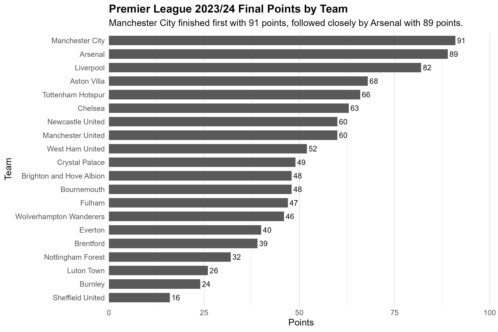
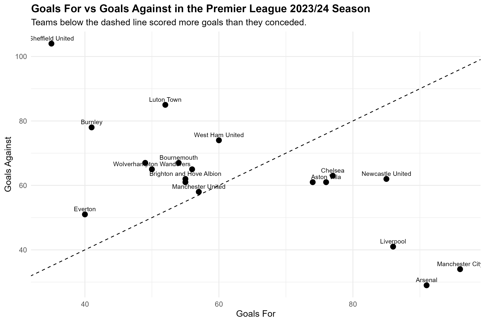
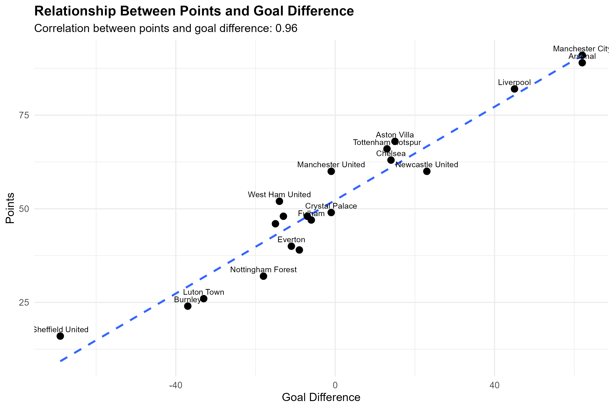

# Premier League Standings Analysis｜英超积分榜数据分析项目

## Project Overview｜项目概览

This project analyzes the final standings of the 2023/24 Premier League season using R.  
本项目使用 R 对 2023/24 赛季英超最终积分榜进行数据分析。

The workflow covers web scraping, data cleaning, CSV export, and data visualization.  
项目流程包括网页数据爬取、数据清洗、CSV 输出和数据可视化。

The goal is to show how raw web data can be converted into a structured dataset and used for simple performance analysis.  
项目目标是展示如何将网页原始数据整理成结构化数据，并用于球队表现分析。

---

## Key Outputs｜主要成果

- Scraped the 2023/24 Premier League standings from the official Premier League website  
- 从英超官网爬取 2023/24 赛季积分榜数据

- Cleaned team-level statistics into a structured dataset  
- 将球队层面的数据清洗成结构化表格

- Created three charts to analyze team performance  
- 生成三张图表分析球队表现

---

## Example Data｜数据示例

The cleaned dataset contains variables such as team ranking, wins, draws, losses, goals, goal difference, and points.  
清洗后的数据包含排名、球队、胜场、平局、负场、进球、失球、净胜球和积分等变量。

| position | team | played | wins | draws | losses | goals_for | goals_against | goal_difference | points |
|---:|---|---:|---:|---:|---:|---:|---:|---:|---:|
| 1 | Manchester City | 38 | 28 | 7 | 3 | 96 | 34 | 62 | 91 |
| 2 | Arsenal | 38 | 28 | 5 | 5 | 91 | 29 | 62 | 89 |
| 3 | Liverpool | 38 | 24 | 10 | 4 | 86 | 41 | 45 | 82 |
| 4 | Aston Villa | 38 | 20 | 8 | 10 | 76 | 61 | 15 | 68 |
| 5 | Tottenham Hotspur | 38 | 20 | 6 | 12 | 74 | 61 | 13 | 66 |

Cleaned data file:  
清洗后数据文件：

```text
data/processed/pl_2023_24_standings_clean.csv
```

---

## Visualizations｜可视化结果

### 1. Final Points by Team｜各球队最终积分

This chart shows the final points of all 20 Premier League teams.  
该图展示 20 支英超球队的最终积分。



---

### 2. Goals For vs Goals Against｜进球数与失球数

This chart compares each team's attacking and defensive performance.  
该图比较各球队的进攻表现和防守表现。



---

### 3. Points vs Goal Difference｜积分与净胜球

This chart shows the relationship between points and goal difference.  
该图展示球队积分与净胜球之间的关系。



---

## Project Structure｜项目结构

```text
Premier_League_Standings_Analysis/
│
├── Premier_League_Standings_Analysis.Rproj
├── Premier_League_Standings_Analysis.Rmd
├── README.md
├── .gitignore
│
├── data/
│   ├── processed/
│   │   └── pl_2023_24_standings_clean.csv
│   └── raw/
│
└── outputs/
    └── figures/
        ├── 01points_bar_chart.png
        ├── 02goals_for_against_scatter.png
        └── 03points_goal_difference_scatter.png
```

---

## How to Run｜运行方式

### 1. Open the RStudio Project｜打开 RStudio 项目

Open the `.Rproj` file in RStudio.  
在 RStudio 中打开 `.Rproj` 文件。

```text
Premier_League_Standings_Analysis.Rproj
```

This helps RStudio set the correct working directory automatically.  
这样可以让 RStudio 自动设置正确的工作目录。

---

### 2. Install Required Packages｜安装所需 R 包

```r
install.packages(c("rvest", "tidyverse", "readr", "stringr", "chromote"))
```

Main packages used in this project:  
本项目主要使用的 R 包：

```r
library(rvest)
library(tidyverse)
library(readr)
library(stringr)
```

---

### 3. Run the R Markdown File｜运行 R Markdown 文件

Open and run the following file from top to bottom.  
打开以下文件，并从上到下运行代码块。

```text
Premier_League_Standings_Analysis.Rmd
```

The workflow is divided into three parts.  
代码流程分为三个部分。

```text
Part 1: Scrape Premier League table page
Part 2: Clean and prepare the data
Part 3: Visualize Premier League 2023/24 standings
```

---

## Notes｜说明

An internet connection is required for the scraping section.  
网页爬取部分需要网络连接。

The Premier League website may update its page structure, so HTML selectors may need adjustment in the future.  
英超官网页面结构可能变化，未来可能需要调整 HTML 选择器。

The `data/raw/` folder is excluded by `.gitignore`, while the cleaned CSV and figures are kept for review.  
`data/raw/` 文件夹通过 `.gitignore` 排除，清洗后的 CSV 和图表会保留，方便查看项目结果。

---

## Skills Demonstrated｜展示能力

- Web scraping with R  
- 使用 R 进行网页数据爬取

- Data cleaning and validation  
- 数据清洗与数据校验

- CSV data output  
- CSV 数据输出

- Data visualization with ggplot2  
- 使用 ggplot2 进行数据可视化

- Reproducible project structure with RStudio Project  
- 使用 RStudio Project 组织可复现项目

---

## Summary｜项目总结

This project demonstrates a complete data analysis workflow from online data collection to visualization.  
本项目展示了从在线数据获取到可视化分析的完整数据分析流程。

It is designed as a portfolio project for data analyst, business analyst, and sports analytics related roles.  
该项目可作为数据分析、商业分析和体育数据分析相关岗位的作品集项目。
